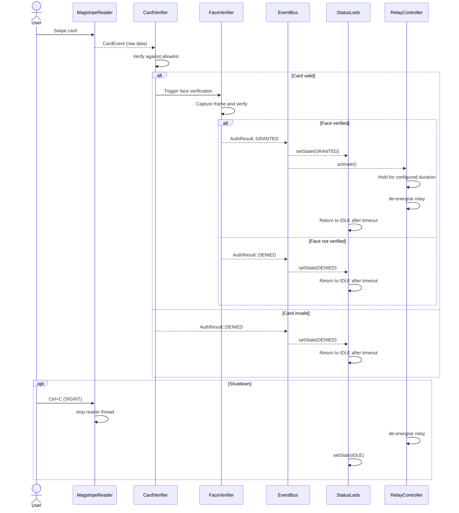

# Realtime Door Access Control System

<p align="center">
  
</p>

A **Raspberry Pi** based realtime door access control prototype combining **magstripe authentication**, **face verification**, and **relay-based door unlocking** — implemented in **C++17** with an event-driven, modular, object-oriented design on Linux.

<p align="center">
  
</p>

---

## Table of Contents

- [Project Overview](#project-overview)
- [Key Features](#key-features)
- [Realtime Requirements](#realtime-requirements)
- [System Architecture](#system-architecture)
- [Sequence Diagram](#sequence-diagram)
- [Hardware Setup](#hardware-setup)
- [Software Design](#software-design)
- [Repository Structure](#repository-structure)
- [Bill of Materials](#bill-of-materials)
- [Dependencies](#dependencies)
- [Cloning](#cloning)
- [Building](#building)
- [Running](#running)
- [Running Software Tests](#running-software-tests)
- [Scope and Decisions](#scope-and-decisions)
- [Documentation](#documentation)
- [Authors and Contributions](#authors-and-contributions)
- [Acknowledgements](#acknowledgements)
- [License](#license)
- [Future Work](#future-work)

---

## Project Overview

The **Realtime Door Access Control System** is a Linux userspace realtime embedded prototype that:

- reads credential input from a **USB magstripe reader**
- verifies card data against a configurable **allowlist**
- performs secondary **face verification** through a camera module
- drives **LED indicators** to reflect access status in realtime
- activates a **relay module** to physically unlock the door on successful authentication
- returns safely to **idle state** after each access event

The design goal is not only functional access control, but access control implemented in a way that is:

- **event-driven** — no polling loops in the control path
- **responsive** — minimal latency between card swipe and actuator response
- **modular** — each hardware concern is isolated behind a clean interface
- **testable** — components can be verified independently from hardware
- **reproducible** — CMake-based build with documented dependencies
- **safe for hardware control** — GPIO and relay state managed through an abstraction layer

The main realtime software path is:

**MagstripeReader → CardVerifier → EventBus → StatusLeds / RelayController**

---

## Key Features

- **Realtime event-driven processing**
  - callback-based card event delivery
  - blocking worker threads with condition variable wake-up
  - no busy-wait polling loops in the authentication pipeline
  - no sleep-based fake realtime timing in the control path

- **Dual-factor authentication**
  - primary: magstripe card credential matching against allowlist
  - secondary: camera-based face verification
  - access granted only when both factors pass

- **Modular C++17 architecture**
  - each module exposes a clean interface and owns its hardware resource
  - `EventBus` decouples publishers from subscribers
  - optional extension modules (proximity, buzzer) do not affect the core pipeline

- **Realtime hardware feedback**
  - three-state LED indication: `idle` (yellow), `granted` (green), `denied` (red)
  - relay actuation within bounded latency from authentication result
  - timed relay release to return the system to locked state

- **Safety-oriented shutdown**
  - graceful `SIGINT` / `Ctrl+C` handling
  - relay de-energised on shutdown
  - LEDs reset to idle state before process exit

- **Assessment-oriented engineering evidence**
  - CMake-based build
  - CTest-integrated automated tests
  - latency measurement across the userspace pipeline
  - Doxygen-ready codebase
  - architecture and state-machine documentation

---

## Realtime Requirements

This project is designed as a realtime embedded prototype. The core realtime requirements are:

| Requirement | Description |
|---|---|
| **Card response latency** | System must respond within a bounded time after card swipe |
| **LED update latency** | LED state must update immediately after authentication decision |
| **Relay activation latency** | Relay must close within bounded time when access is granted |
| **Idle return** | System must return to idle predictably after each event |
| **No blocking in control flow** | Authentication pipeline must not block the main event loop |
| **Safe shutdown** | All hardware outputs must be de-energised on graceful stop |

The software is structured around event-driven processing, callbacks, timers, and modular components rather than a single monolithic control flow.

---

## System Architecture

<p align="center">
  
</p>

The repository is organised around a staged runtime pipeline.

### Core Modules

- **MagstripeReader**  
  Reads raw card data from the USB HID device. Delivers card events through a registered callback on a dedicated reader thread.

- **CardVerifier**  
  Verifies whether the presented card credential exists in the configured allowlist. Returns a typed `AuthResult`.

- **FaceVerifier**  
  Captures a frame from the camera module and runs face verification. Invoked after successful card verification as the second authentication factor.

- **EventBus**  
  Dispatches typed authentication result events to all registered subscriber modules. Decouples the verification pipeline from output control.

- **StatusLeds**  
  Controls the three-LED status indicator through GPIO. Manages timed transitions from `granted` / `denied` back to `idle`.

- **RelayController**  
  Drives the door relay through GPIO. Activates on `granted` event, de-energises after a configured hold duration.

- **ProximitySensor** *(optional)*  
  HC-SR04 ultrasonic range sensing. Can trigger pre-authentication wake-up or proximity logging.

- **Buzzer** *(optional)*  
  Audio feedback on access events.

- **AccessLogger** *(optional)*  
  Writes timestamped access records to a local log file.

### Threading Model

The runtime uses separate threads with blocking waits:

- **reader thread** — blocks on USB HID device read; delivers card events via callback
- **verification thread** — runs card and face verification on received events
- **output thread** — drives LEDs and relay from authentication results
- **main thread** — application lifecycle, signal handling, and optional UI

### Queue Policy

Inter-stage communication uses bounded queues with a **freshest-data** policy:

- card event queue capacity: **1**
- authentication result queue capacity: **1**

This avoids stale backlog and ensures the system always acts on the most recent event.

---

## Sequence Diagram



---

## Hardware Setup

<p align="center">
  
</p>

The hardware setup connects:

- a **USB magstripe reader** directly to the Raspberry Pi USB port
- a **camera module** through the CSI ribbon connector
- a **relay module** to a GPIO output pin (active-high or active-low configurable)
- three **LEDs** (red, yellow, green) to GPIO output pins through current-limiting resistors
- optionally an **HC-SR04 ultrasonic sensor** for proximity detection
- optionally a **buzzer** for audio feedback

GPIO is managed through `libgpiod` for portable, udev-friendly access without requiring root.

---

## Software Design

### Module Interfaces

Each module is defined by a pure abstract interface (`I`-prefixed header) and a concrete implementation. This supports unit testing with mocks and clean dependency injection.

```
ICardReader       ← MagstripeReader
ICardVerifier     ← CardVerifier
IFaceVerifier     ← FaceVerifier
IEventBus         ← EventBus
IStatusLeds       ← StatusLeds
IRelayController  ← RelayController
```

### Design Characteristics

- **object-oriented**: each hardware concern is owned by one module
- **modular**: modules interact only through interfaces and the EventBus
- **event-driven**: callbacks drive the pipeline; no polling in the main path
- **callback-based**: card events delivered asynchronously from the reader thread
- **GPIO abstraction**: `libgpiod` used throughout; no direct `/sys/class/gpio` access
- **realtime-oriented**: bounded queues, blocking waits, no artificial sleep in the control path

### State Machine

The system operates across four named states:

| State    | Description                                      |
|----------|--------------------------------------------------|
| `IDLE`   | Awaiting card swipe; yellow LED on               |
| `VERIFYING` | Authentication in progress                    |
| `GRANTED` | Access allowed; green LED on; relay active      |
| `DENIED`  | Access refused; red LED on                     |

All states return to `IDLE` after their respective hold durations.

---

## Repository Structure

```text
DoorAccessControl/
├── .github/
├── diagrams/
├── docs/
├── include/
│   ├── auth/
│   ├── common/
│   ├── hal/
│   ├── io/
│   ├── system/
│   └── vision/
├── media/
├── scripts/
├── src/
│   ├── auth/
│   ├── common/
│   ├── hal/
│   ├── io/
│   ├── system/
│   └── vision/
├── tests/
├── CMakeLists.txt
├── Doxyfile
├── CONTRIBUTING.md
└── LICENSE
```

---

## Bill of Materials

### Controller

| Component            | Quantity | Cost (£) |
| -------------------- | -------: | -------: |
| Raspberry Pi 5 (8GB) |        1 |    80.00 |

### Sensors and Vision

| Component              | Quantity | Cost (£) |
| ---------------------- | -------: | -------: |
| USB Magstripe Reader   |        1 |    15.00 |
| Camera Module (IMX219) |        1 |    25.00 |

### Actuation and Indication

| Component                          | Quantity | Cost (£) |
| ---------------------------------- | -------: | -------: |
| 5V Relay Module                    |        1 |     5.00 |
| Red LED                            |        1 |     0.50 |
| Yellow LED                         |        1 |     0.50 |
| Green LED                          |        1 |     0.50 |
| 330Ω Resistors                     |        3 |     0.50 |

### Optional Components

| Component                  | Quantity | Cost (£) |
| -------------------------- | -------: | -------: |
| HC-SR04 Ultrasonic Sensor  |        1 |     3.00 |
| Piezo Buzzer               |        1 |     2.00 |

### Mechanical and Supporting Components

| Component                  | Quantity | Cost (£) |
| -------------------------- | -------: | -------: |
| Breadboard and Wiring Set  |        1 |    10.00 |
| Fasteners and Mounts       | Assorted |     5.00 |

### Grand Total

**£147.00**

---

## Dependencies

### Mandatory

- **CMake 3.16 or newer**
- **C++17 compiler**
  - GCC
  - Clang
- **libgpiod**  
  GPIO access on Linux without root.

### Optional

- **OpenCV**  
  Enables face verification and camera frame processing.

- **libcamera**  
  Enables direct camera backend support on Raspberry Pi.

- **Doxygen / Graphviz**  
  Generates API documentation from source.

### Linux Packages

Minimal build tools:

```bash
sudo apt update
sudo apt install -y build-essential cmake git pkg-config
```

Required runtime:

```bash
sudo apt install -y libgpiod-dev
```

Optional packages:

```bash
sudo apt install -y libopencv-dev
sudo apt install -y libcamera-dev
sudo apt install -y doxygen graphviz
```

---

## Cloning

```bash
git clone https://github.com/your-org/DoorAccessControl.git
cd DoorAccessControl
```

---

## Building

### Linux / Raspberry Pi OS

Configure:

```bash
cmake -S . -B build -DCMAKE_BUILD_TYPE=Release
```

Build:

```bash
cmake --build build -j
```

### Optional: disable OpenCV auto-detection

```bash
cmake -S . -B build -DCMAKE_BUILD_TYPE=Release -DDAC_TRY_OPENCV=OFF
```

---

## Running

### Core CLI application

```bash
./build/door_access_control
```

### Software-only simulation mode

The software-only path uses a simulated card reader and a non-hardware GPIO backend for development and testing without the physical platform.

```bash
./build/door_access_control --simulate
```

### Hardware mode

Hardware execution requires:

- `libgpiod` and correct GPIO chip path configured
- relay wired and powered correctly
- LEDs wired with appropriate current-limiting resistors
- camera module connected and detected by the system

The system will enter **FAULT** if required hardware is unavailable or startup fails.

### Manual GPIO smoke test

```bash
./build/tests/gpio_manual_smoketest
```

---

## Running Software Tests

This project integrates tests with **CTest**.

### Linux

```bash
ctest --test-dir build --output-on-failure
```

### Included Automated Test Areas

- `CardVerifier` — allowlist matching and edge cases
- `EventBus` — subscriber dispatch correctness
- `StatusLeds` — state transition logic
- `RelayController` — timing and de-energisation
- `ThreadSafeQueue` — bounded queue behaviour under concurrent access
- `AccessLogger` — log format and file output
- `SystemManager` state machine — all state transitions

### Optional Hardware Integration Tests

Where supported by platform and dependencies, the repository also includes hardware-related tests for:

- `libgpiod` GPIO output verification
- relay actuation timing
- USB HID reader event delivery

---

## Scope and Decisions

### Features in Final Scope

| Feature | Status |
|---|---|
| Magstripe card input | ✅ Implemented |
| Allowlist-based credential verification | ✅ Implemented |
| Face verification (camera) | ✅ Implemented |
| LED status indication | ✅ Implemented |
| Relay-controlled door unlock | ✅ Implemented |
| Graceful shutdown on `Ctrl+C` | ✅ Implemented |
| HC-SR04 proximity sensing | ✅ Optional extension |
| Buzzer feedback | ✅ Optional extension |
| Local access logging | ✅ Optional extension |

### Features Removed from Scope

| Feature | Reason |
|---|---|
| NFC authentication | Removed in favour of a more reliable magstripe prototype |

The original concept included NFC as an authentication method. After evaluating hardware availability and prototype reliability, the final scope was refined to magstripe input, face verification, and relay control — a more robust and achievable system within the project constraints.

---

## Documentation

Project documentation is stored in `docs/` and includes:

- `docs/BOM.md`
- `docs/build_and_run.md`
- `docs/DEPENDENCIES.md`
- `docs/REPRODUCIBILITY.md`
- `docs/requirements.md`
- `docs/state_machine.md`
- `docs/system_architecture.md`
- `docs/testing.md`
- `docs/user_stories_use_cases.md`
- `docs/realtime_analysis.md`
- `docs/scope_decisions.md`

### Generate Doxygen Documentation

```bash
doxygen Doxyfile
```

Open locally at:

```text
docs/html/index.html
```

---

## Authors and Contributions

*(List your project members and their contributions here, following the same structure as your group's contribution record.)*

---

## Acknowledgements

We would like to thank:

- **Dr. Bernd Porr** for guidance in realtime embedded systems and architecture design
- **Dr. Chongfeng Wei** for software engineering support and project supervision
- the **University of Glasgow**
- the laboratory, workshop, and technical support staff involved in supporting the project

Their teaching, feedback, and infrastructure helped shape both the realtime architecture and the software-engineering process behind this repository.

---

## License

This project is released under the license included in this repository:

```text
LICENSE
```

Please also credit any external libraries, frameworks, or reused components according to their original licenses.

---

## Future Work

Planned or natural next extensions include:

- full hardware-validated closed-loop operation with door sensor feedback
- RFID / NFC authentication as an additional credential method
- encrypted allowlist storage
- remote administration interface for allowlist management
- richer telemetry and live access dashboard
- multi-door support with centralised event routing
- enhanced fault handling and hardware error recovery
- more polished project media, demo video, and public-facing documentation

---

## Last Updated

March 2026
