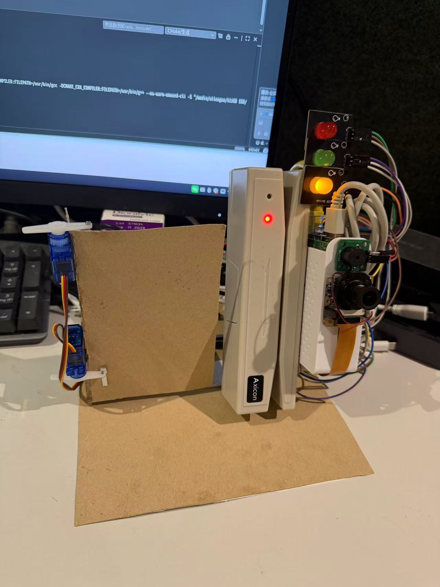
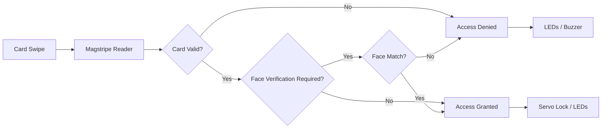
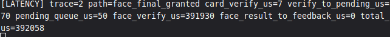
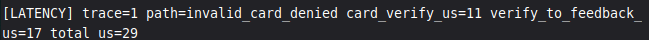

# Door Access Control

A Raspberry Pi based realtime door access control prototype with magstripe authentication, risk-aware face verification, servo lock control, and event-driven C++ modules.

<table align="center">
  <tr>
    <td align="center">
      
    </td>
    <td align="center">
      
    </td>
  </tr>
</table>

## Overview

This project is a realtime door access control system developed on Raspberry Pi for **ENG5220 Real Time Embedded Programming**.

It combines:

- magnetic stripe credential input
- card verification
- risk-aware face verification
- event-driven hardware feedback
- servo-based lock actuation

The goal is to keep the normal access path very fast, while only invoking the more expensive face verification stage when the situation is considered high risk.

---

## Project Structure

```text
.
├── include/         # Header files
├── src/             # Main application source code
├── training/        # Face model training tool
├── tests/           # Unit tests
├── models/          # Trained face model and cascade files
├── docs/            # Images and project assets
├── LICENSE
└── README.md
```

---

## Core Features

- Magstripe-based access input
- Allowlist-based card verification
- Risk-triggered face verification
- Servo-based lock actuation
- LED and buzzer feedback
- Event-driven C++ design on Linux
- Realtime latency tracing

---

## System Workflow



---

## System Status Indication

The current implementation provides system feedback through LEDs, buzzer, and servo lock control.

| System State | Trigger | LED Behaviour | Buzzer Behaviour | Lock Behaviour |
|---|---|---|---|---|
| Idle | System startup / reset | Yellow ON, Red OFF, Green OFF | Off | Locked |
| Access Denied | Invalid card or failed face verification | Red ON, Yellow ON, Green OFF | Three short beeps | Locked |
| Face Verification Required | Valid card under high-risk condition | Red ON, Yellow ON, Green ON | Two short beeps | Locked |
| Access Granted | Valid card accepted or face verification passed | Green ON, Yellow ON, Red OFF | One short beep | Unlocked temporarily, then locked again automatically |

> In the current code, **granted** and **denied** states are held for about **2 seconds** before returning to **Idle** automatically.

---

## Hardware

> Components were sourced from both China and the UK, so prices are shown in their original purchase currency.

| Image | Component | Purpose | Price |
|---|---|---|---|
|  | Raspberry Pi 5 (4GB) | Main controller | Provided by lab |
|  | Breadboard | Circuit prototyping and wiring | ¥6 |
|  | Jumper Wires (female-to-female, female-to-male) | GPIO and module connections | ¥8 |
|  | USB Magstripe Reader | Card input | ¥28 |
|  | Camera | Face verification | ¥40 |
|  | LEDs (Red / Yellow / Green) | System status indication | ¥6 |
|  | Buzzer | Alarm feedback | £4 |
|  | 2 × SG90 Servo Motors | Door lock actuation | £12 |

---

## Wiring / GPIO Mapping

The current prototype uses the following Raspberry Pi GPIO assignments:

| Module | GPIO Pin |
|---|---:|
| Red LED | 17 |
| Yellow LED | 27 |
| Green LED | 22 |
| Buzzer | 18 |
| Servo 1 | 12 |
| Servo 2 | 13 |

> These GPIO assignments are currently hard-coded in `src/main.cpp`.

The GPIO chip used in the code is:

```text
gpiochip0
```

If your wiring is different, update the GPIO pin definitions in `src/main.cpp` before building.

---

## Software Requirements

This project was developed for **Raspberry Pi 5**.

### Required software and libraries

- CMake 3.16+
- C++17 compiler (`g++`)
- OpenCV with:
  - `core`
  - `imgproc`
  - `highgui`
  - `videoio`
  - `objdetect`
  - `face`
- `libgpiod`
- `rpicam-apps` (provides `rpicam-vid` for CSI camera streaming)

### Install dependencies

```bash
sudo apt update
sudo apt install -y \
  cmake \
  g++ \
  libgpiod-dev \
  libopencv-dev \
  libopencv-contrib-dev \
  rpicam-apps
```

---

## Build

Clone the repository and build the main project:

```bash
git clone https://github.com/Guo-Yinchen/Door-access-control.git
cd Door-access-control
cmake -S . -B build
cmake --build build -j
```

### Optional: build without GPIO support

This is useful for **compile checking only** when GPIO hardware is not available.

```bash
cmake -S . -B build-no-gpio -DENABLE_GPIO=OFF
cmake --build build-no-gpio -j
```

> Note: the main application still expects the CSI camera path at runtime, so this option is mainly for build verification rather than full functional use.

---

## Run

Run the main program:

```bash
./build/door_access_control
```

If your system reports permission errors when opening the magnetic stripe input device, try:

```bash
sudo ./build/door_access_control
```

### Runtime notes

- The full system is intended to run on **Raspberry Pi hardware**.
- The program expects:
  - a CSI camera accessible via `rpicam-vid`
  - a USB magnetic stripe reader
  - GPIO-connected LEDs, buzzer, and servos
- Compilation may succeed even if the hardware is absent, but the full program will not behave correctly at runtime without the required devices.

---

## Hardware Assumptions

This repository currently assumes the following hardware setup:

- **Raspberry Pi 5**
- **CSI camera** connected and working with `rpicam-vid`
- **USB magnetic stripe reader**
- LEDs, buzzer, and SG90 servo motors connected to the GPIO pins listed above

### Magnetic stripe reader device path

The current code uses this default input device path:

```text
/dev/input/by-id/usb-DECETECH.COM.CN_DK_131K-UL_V7.76-event-kbd
```

If your reader appears under a different event device, update the default path in:

```text
include/Magnetic-reader/Magnetic-reader.hpp
```

You can inspect available input devices with:

```bash
ls -l /dev/input/by-id/
cat /proc/bus/input/devices
```

### Camera requirement

The face verification module uses:

```bash
rpicam-vid
```

You can verify that the camera stack is available with:

```bash
rpicam-vid --help
```

---

## Testing

The repository includes unit tests for selected modules.

### Build and run tests

```bash
cmake -S tests -B build/tests
cmake --build build/tests -j
ctest --test-dir build/tests --output-on-failure
```

### Covered modules

Current unit tests cover:

- `CardVerifier`
- `EventBus`

Example test output:


---

## Face Model Training

A dedicated training tool is included in the `training/` folder.

### Dataset structure

Training images should be placed in a dataset directory organised by card ID:

```text
dataset/
├── 10320049/
│   ├── img1.jpg
│   ├── img2.jpg
│   └── img3.jpg
```

Each subfolder name is treated as the user's card ID, and all images inside that folder are used as training samples for that user.

### Build the training tool

```bash
cmake -S training -B build/training
cmake --build build/training -j
```

### Run training

```bash
./build/training/train_faces \
  dataset \
  models/haarcascade_frontalface_default.xml \
  models/lbph_faces.yml \
  models/face_labels.txt
```

### What the training tool does

The training program automatically:

- scans each card-ID folder inside the dataset directory
- loads supported image files (`.jpg`, `.jpeg`, `.png`, `.bmp`)
- detects the largest face in each image
- converts the face to grayscale
- resizes it to `160x160`
- applies histogram equalisation
- trains an LBPH face recognition model
- writes the trained model to `models/lbph_faces.yml`
- writes the label-to-card mapping to `models/face_labels.txt`

Images where no face is detected are skipped automatically.

### Notes

- Folder names in `dataset/` must match the card IDs used by the access-control system.
- After retraining, the main program will use the updated files in `models/`.
- A pre-trained demo model is already included in this repository, so the project can be tested without retraining first.

---

## Realtime Performance

The system logs internal latency traces to measure how quickly each authentication path responds.

### Measured latency

- **Valid card, normal mode:** ~**83 μs**
- **Invalid card:** ~**24–25 μs**
- **High-risk trigger → face verification pending:** ~**27–31 μs**
- **High-risk path with face match:** ~**2.94 s**
- **High-risk path with face mismatch:** ~**6.05 s**

### What this means

The core access-control pipeline is very fast.

Card verification and risk-policy decisions complete in only a few microseconds, so the system can react to card events almost instantly.

The main delay comes from the **face verification stage**, not from the event-driven control logic itself. This is expected because face verification requires live camera capture, face detection, and repeated prediction across multiple frames before a final decision is made.

In practice, this gives the system two behaviours:

- **Low-risk access:** near-instant response
- **High-risk access:** slower, secondary biometric verification for extra security

This fits the design goal of the project: keep normal door access responsive, while adding a more expensive verification step only when the situation is considered risky.

### Example traces

#### valid_card_granted total


#### invalid_card_denied total


---

## Runtime Controls

- `d` + `Enter`: enable force-face demo mode
- `n` + `Enter`: return to normal risk policy
- `Ctrl+C`: graceful shutdown
---
## Social Media


Project updates and demo clips are available here:

- TikTok: https://www.tiktok.com/@d.a.control
- YouTube: https://www.youtube.com/@Dongxin-pp8ee/shorts
---
## Team Contributions

- **Guo Yinchen**: core implementation, integration, hardware setup, documentation
- **Zhuoxian Cai**: servo motor control, jitter reduction, testing
- **Yin Bole**: documentation support, unit testing
- **Wenqiang Ding**: initial logging prototype (not integrated into final system), bug fixing
- **Po Hsiang Chiu**: bug fixing, video editing

---

## License

This project is released under the **MIT License**.  
See the [LICENSE](LICENSE) file for details.

## AI Usage Statement

 [AI Usage Statement](./docs/AI_USAGE_STATEMENT.md)
