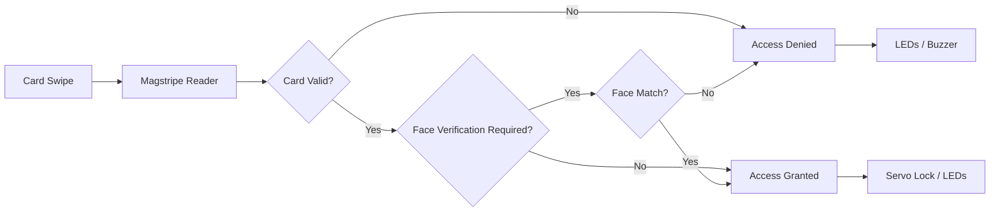

# Door Access Control

A Raspberry Pi based realtime door access control prototype with magstripe authentication, risk-aware face verification, servo lock control, and event-driven C++ modules.


## Overview

This project is a realtime door access control system developed on Raspberry Pi for ENG5220.  
It combines credential input, verification logic, hardware feedback, and modular C++ components into a responsive embedded prototype.

## Core Features

- Magstripe-based access input
- Risk-triggered face verification
- Servo-based lock actuation
- LED and buzzer feedback
- Event-driven C++ design on Linux

## System Workflow



## Hardware

> Components were sourced from both China and the UK, so prices are shown in their original purchase currency.

| Image | Component | Purpose | Price |
|---|---|---|---|
|  | Raspberry Pi 5 (4GB) | Main controller | Provided by lab |
|  | Breadboard | Circuit prototyping and wiring | ¥6 |
|  | Jumper Wires (female-to-female, female-to-male) | GPIO and module connections | ¥8 |
|  | USB Magstripe Reader | Card input | ¥28 |
|  | Camera | Face verification | ¥40 |
|  | LEDs (Red / Yellow / Green) | System status indication | ¥6 |
|  | Buzzer | Alarm feedback | £4 |
|  | SG90 Servo Motor | Door lock actuation | £6 |

## Prerequisites

- Linux on Raspberry Pi
- CMake 3.16+
- C++17 compiler
- OpenCV with `core`, `imgproc`, `highgui`, `videoio`, `objdetect`, and `face`
- `libgpiod`

Install the required packages:

```bash
sudo apt update
sudo apt install -y cmake g++ libgpiod-dev libopencv-dev libopencv-contrib-dev
```
## Build & Run

Build the project:

```bash
cmake -S . -B build
cmake --build build -j
```
Run the program:
```bash
./build/door_access_control
```

## Testing

The repository includes unit tests for selected modules.

```bash
cmake -S tests -B build/tests
cmake --build build/tests -j
ctest --test-dir build/tests --output-on-failure
```
Example test output:


## Social Media

Project updates and demo clips will be shared here:

- TikTok: [Coming soon]
- YouTube: [Coming soon]

## Team Contributions

- Guo Yinchen: core implementation, integration, hardware setup, documentation
- Zhuoxian Cai: to be updated
- Yin Bole: documentation support, unit test 
- Wenqiang Ding: to be updated
- Po Hsiang Chiu: to be updated

## License

This project is released under the MIT License.  
See the [LICENSE](LICENSE) file for details.