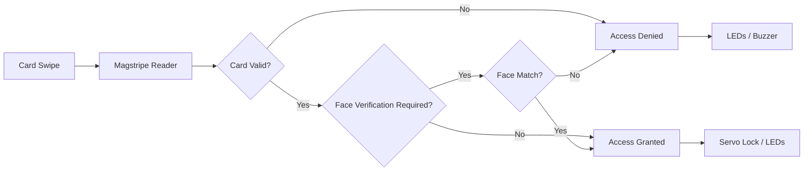

# Door Access Control

A Raspberry Pi based realtime door access control prototype with magstripe authentication, risk-aware face verification, servo lock control, and event-driven C++ modules.


<table align="center">
  <tr>
    <td align="center">
      
    </td>
    <td align="center">
      
    </td>
  </tr>
</table>
## Overview

This project is a realtime door access control system developed on Raspberry Pi for ENG5220.  
It combines credential input, verification logic, hardware feedback, and modular C++ components into a responsive embedded prototype.
## Project Structure

- `src/` main application source code
- `training/` face model training tool
- `tests/` unit tests
- `models/` trained face model and cascade files
- `docs/` images and project assets
## Core Features

- Magstripe-based access input
- Risk-triggered face verification
- Servo-based lock actuation
- LED and buzzer feedback
- Event-driven C++ design on Linux

## System Workflow


### System Status Indication

The current implementation provides system feedback through LEDs, buzzer, and servo lock control.

| System State | Trigger | LED Behaviour | Buzzer Behaviour | Lock Behaviour |
|---|---|---|---|---|
| Idle | System startup / reset | Yellow ON, Red OFF, Green OFF | Off | Locked |
| Access Denied | Invalid card or failed face verification | Red ON, Yellow ON, Green OFF | Three short beeps | Locked |
| Face Verification Required | Valid card under high-risk condition | Red ON, Yellow ON, Green ON | Two short beeps | Locked |
| Access Granted | Valid card accepted or face verification passed | Green ON, Yellow ON, Red OFF | One short beep | Unlocked temporarily, then locked again automatically |

> In the current code, **granted** and **denied** states are held for about **2 seconds** before returning to **Idle** automatically.

## Hardware

> Components were sourced from both China and the UK, so prices are shown in their original purchase currency.

| Image | Component | Purpose | Price |
|---|---|---|---|
|  | Raspberry Pi 5 (4GB) | Main controller | Provided by lab |
|  | Breadboard | Circuit prototyping and wiring | ¥6 |
|  | Jumper Wires (female-to-female, female-to-male) | GPIO and module connections | ¥8 |
|  | USB Magstripe Reader | Card input | ¥28 |
|  | Camera | Face verification | ¥40 |
|  | LEDs (Red / Yellow / Green) | System status indication | ¥6 |
|  | Buzzer | Alarm feedback | £4 |
|  | SG90 Servo Motor | Door lock actuation | £6 |

## Prerequisites

- Linux on Raspberry Pi
- CMake 3.16+
- C++17 compiler
- OpenCV with `core`, `imgproc`, `highgui`, `videoio`, `objdetect`, and `face`
- `libgpiod`

Install the required packages:

```bash
sudo apt update
sudo apt install -y cmake g++ libgpiod-dev libopencv-dev libopencv-contrib-dev
```
## Build & Run

Build the project:

```bash
cmake -S . -B build
cmake --build build -j
```
Run the program:
```bash
./build/door_access_control
```
## Testing

The repository includes unit tests for selected modules.

```bash
cmake -S tests -B build/tests
cmake --build build/tests -j
ctest --test-dir build/tests --output-on-failure
```
Example test output:


## Face Model Training

A dedicated training tool is included in the `training/` folder.

### Dataset structure

Training images should be placed in a dataset directory organised by card ID:

```text
dataset/
├── 10320049/
│   ├── img1.jpg
│   ├── img2.jpg
│   └── img3.jpg
```
Each subfolder name is treated as the user's card ID, and all images inside that folder are used as training samples for that user.

### Build the training tool
```bash
cmake -S training -B build/training
cmake --build build/training -j
```

### Run training
```bash
./build/training/train_faces \
  dataset \
  models/haarcascade_frontalface_default.xml \
  models/lbph_faces.yml \
  models/face_labels.txt
```
### What the training tool does

The training program automatically:

scans each card-ID folder inside the dataset directory
loads supported image files (.jpg, .jpeg, .png, .bmp)
detects the largest face in each image
converts the face to grayscale
resizes it to 160x160
applies histogram equalisation
trains an LBPH face recognition model
writes the trained model to models/lbph_faces.yml
writes the label-to-card mapping to models/face_labels.txt

Images where no face is detected are skipped automatically.

### Notes
Folder names in dataset/ must match the card IDs used by the access-control system.
After retraining, the main program will use the updated files in models/.
A pre-trained demo model is already included in this repository, so the project can be tested without retraining first.
## Realtime Performance

The system logs internal latency traces to measure how quickly each authentication path responds.

### Measured latency

- **Valid card, normal mode:** ~**83 μs**
- **Invalid card:** ~**24–25 μs**
- **High-risk trigger → face verification pending:** ~**27–31 μs**
- **High-risk path with face match:** ~**2.94 s**
- **High-risk path with face mismatch:** ~**6.05 s**

### What this means

The core access-control pipeline is very fast.  
Card verification and risk-policy decisions complete in only a few microseconds, so the system can react to card events almost instantly.

The main delay comes from the **face verification stage**, not from the event-driven control logic itself. This is expected because face verification requires live camera capture, face detection, and repeated prediction across multiple frames before a final decision is made.

In practice, this gives the system two behaviours:

- **Low-risk access:** near-instant response
- **High-risk access:** slower, secondary biometric verification for extra security

This fits the design goal of the project: keep normal door access responsive, while adding a more expensive verification step only when the situation is considered risky.

### Example traces
#### valid_card_granted total

#### invalid_card_denied total


## Runtime Controls

- `d` + `Enter`: enable force-face demo mode
- `n` + `Enter`: return to normal risk policy
- `Ctrl+C`: graceful shutdown

## Social Media

Project updates and demo clips will be shared here:

- TikTok: https://www.tiktok.com/@d.a.control
- YouTube: https://www.youtube.com/channel/UC-V3Io8VhV6NMzuq4lF-zSw

## Team Contributions

- Guo Yinchen: core implementation, integration, hardware setup, documentation
- Zhuoxian Cai: Servo motor control, jitter reduction, testing
- Yin Bole: documentation support, unit test 
- Wenqiang Ding: initial logging prototype (not integrated into final system), bug fix
- Po Hsiang Chiu: bug fix, Video editing
## License

This project is released under the MIT License.  
See the [LICENSE](LICENSE) file for details.
